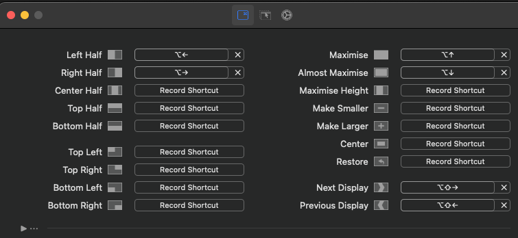
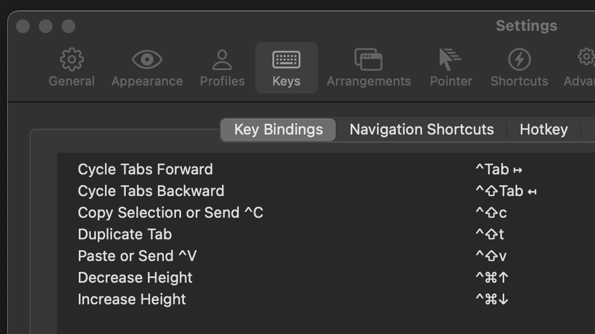

# Opinionated MacOS configuration

This page describes my MacOS system configuration. Some/most configurations are designed to emulate the way things are done in Linux (specifically Ubuntu) and my favorite applications there. 

## Package management

Install the `brew` package manager, see https://brew.sh/ . Not all applications can be installed there, but many can. 

Some essential packages, remove any which you don't use: 

```bash
brew install \
  firefox \
  slack \
  alt-tab \
  direnv \
  autojump \
  python \
  node \
  kubectl \
  ncdu \
  ag \
  jq \
  yq \
  gpg \
  meld \
  fdupes

curl https://raw.githubusercontent.com/git/git/master/contrib/completion/git-completion.bash -o ~/.git-completion.bash
```

See https://docs.docker.com/desktop/install/mac-install/ for Docker. 

## Window management

Install [Rectangle](https://rectangleapp.com/). The most essential shortcuts (imo), which I use, are pictured. 



## Window switching

The default switcher in MacOS switches between running applications, not windows. This can be confusing if an application has more or less than one window. Install [AltTab](https://alt-tab-macos.netlify.app/) to get more familiar behavior on Alt(Cmd)+Tab

## Terminal replacement / Guake substitute

I like [`guake`](https://github.com/Guake/guake), but that's unavailable in MacOS. Instead I use [`iTerm2`](https://iterm2.com/), which I configured as a dropdown terminal. 
 - Follow [these steps](https://dev.to/vikbert/drop-down-iterm2-in-macos-2od) to configure it as a drowndown terminal
 - Add custom keybindings. Pictured are some of the most crucial ones.  

### VS Code 

VS Code has different default keybindings in different OS's. To get the keybindings you're used to, see https://github.com/codebling/vs-code-default-keybindings . 
You'll need to do a text replacement for `alt` => `cmd` in `keybindings.json`. 

## OS-level keybindings

MacOS has some configurability of keybindings in `System settings`->`Keyboards`, but this is very limited. Instead, download `Karabiner`. With Karabiner you can add shortcuts that work for all applications. 

 - Get this config as a starting point: `curl https://ke-complex-modifications.pqrs.org/json/windows_shortcuts_on_macos.json > ~/.config/karabiner/assets/complex_modifications/keybindings.json`. 
 - Make the following modifications: 
   - Since we will fine-tune VSCode independently, exclude it from most of the rules. This is necessary to avoid conflicts. Do this by adding `"^com\\.microsoft\\.VSCode$",` to `manipulators.conditions.bundle_identifiers` of each binding. Exceptions: don't do this to entries labeled as being for "browsers only", or for "Finder only", nor for the logout, launchpad, or activity monitor bindings. 
   - If you experience unexpected keybindings in other applications, you can find the 'bundle name' (an app identifier in MacOS) for those apps and try to do the same for those.  
   - Remove the `Cmd+Tab => Cmd+Alt+0` rule, because it conflicts with our mapping from Alt/Cmd+Tab, which is more important. 
   - Modify the two mappings under the `Ctrl+(Shift)+Right/left arrow => Alt+(Shift)+Right/left arrow` rule to map to `left_command` instead of `left_option`. Seems like this is what's intended in the description, this might be a bug. 
   - Add rule for `Ctrl+Backspace => Cmd+Backspace`

This results in [./keybindings-karabiner.json]. 

Now go to `Complex Modifications` in Karabiner, then `Add predefined rule` and hit `Enable all` at the bottom. If you make changes to the json, you'll need to delete all your applied rules in the UI and readd them. It may take a few seconds before the keybindings are applied. 

## Default shell and bash configuration

The default shell is zsh. If you prefer bash, you can change it with `chsh -s /bin/bash`. `.profile` is called `.bash_profile` in MacOS. To get rid of the warning which will follow on every new shell, add `export BASH_SILENCE_DEPRECATION_WARNING=1` to your `.bash_profile`. 

See my [`.bash_profile`](./.bash_profile) and [`./bashrc`](./bashrc). 

## UI tweaks

You can unpin items from the dock at the bottom of the screen by right-clicking them and selecting 'Remove from dock'. It's also possible to make the dock auto-hide. 

The default file navigator is called Finder and seems impossible to remove. You can configure which directory shortcuts are present in its sidebar through its application settings (right click the Finder text in the upper left of your screen when a Finder window is in focus, and select Settings). 

The download widget in the dock shows recent downloads in a curved list. If you don't like this, you can change it to render as a normal list through options found by right-clicking the widget. 

## Mitigating trash file creation

MacOS's built-in graphicla file navigation program 'Finder' creates trash files names `.DS_Store` throughout your system. These files store rendering configuration used by the Finder GUI. I haven't found any way to stop this very rude behavior, except for on networked or plugged-in devices. That's at least something. 

```bash
defaults write com.apple.desktopservices DSDontWriteNetworkStores -bool true
defaults write com.apple.desktopservices DSDontWriteUSBStores -bool true
```